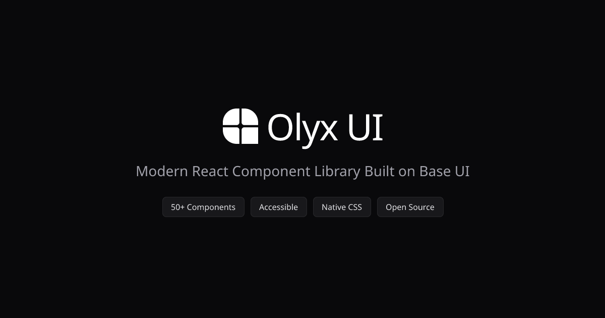

<div align="center">



# Olyx UI

**50+ React components. Native CSS. No class soup.**

Accessible, composable components built on [Base UI](https://base-ui.com/) with modern CSS and [HCT color science](https://material.io/blog/science-of-color-design). Copy, paste, and own your UI.

[](https://www.npmjs.com/package/@olyx/cli)
[](https://www.npmjs.com/package/@olyx/react)
[](https://github.com/ramo4040/olyx-ui/stargazers)
[](./LICENSE)

[Documentation](https://olyxui.com/docs) · [Components](https://olyxui.com/docs/components/accordion) · [Get Started](https://olyxui.com/docs/get-started)

</div>

---

## Why Olyx?

Most React component libraries style with Tailwind utilities. Your button ends up looking like this:

```tsx
// ❌ Other libraries — CSS dump in your JSX
<button className="inline-flex items-center justify-center rounded-md text-sm
  font-medium ring-offset-background transition-colors focus-visible:outline-none
  focus-visible:ring-2 focus-visible:ring-ring disabled:pointer-events-none
  disabled:opacity-50 bg-primary text-primary-foreground hover:bg-primary/90
  h-10 px-4 py-2">
  Click me
</button>
```

Olyx keeps your markup clean. The styling lives in CSS where it belongs:

```tsx
// ✅ Olyx — props, not class strings
<Button variant="primary" mode="filled" size="md">
  Click me
</Button>
```

```css
/* Scoped by data attributes — readable, overridable, debuggable */
[data-ui="button"][data-mode="filled"] {
  background-color: var(--color-button);
  color: var(--color-on-button);
}
```

## Quick Start

```sh
# Initialize Olyx in your project
npx olyx init

# Add components
npx olyx add button
npx olyx add button input dialog
```

Or copy component code directly from [the docs](https://olyxui.com/docs/components/accordion).

### Requirements

- React 19+
- TypeScript 5+ (recommended)

## Architecture

### Native CSS with Data Attributes

Every component uses `data-*` attributes for variant styling. No runtime CSS-in-JS, no utility class concatenation:

```tsx
// Component outputs clean, semantic markup
<ButtonPrimitive
  data-ui="button"
  data-variant={variant}
  data-mode={mode}
  data-size={size}
  {...rest}
>
  {children}
</ButtonPrimitive>
```

CSS handles the visual logic using `@layer`, custom properties, and modern selectors:

```css
@layer components {
  [data-ui="button"] {
    display: inline-flex;
    align-items: center;
    height: var(--button-size);
    transition: all var(--transition-expressive-fast-effects);
  }

  [data-ui="button"][data-size="md"] {
    --button-size: 36px;
    padding-inline: var(--spacing-12);
    border-radius: var(--radius-md);
  }
}
```

### Base UI Foundation

Built on [Base UI](https://base-ui.com/) — the unstyled primitive layer from the MUI team. Every component inherits proper accessibility, keyboard navigation, and focus management out of the box.

### HCT Color System

Colors powered by Google's [HCT (Hue-Chroma-Tone)](https://material.io/blog/science-of-color-design) color space. Unlike RGB/HSL where "same lightness" doesn't mean "same perceived brightness," HCT is perceptually uniform. This means:

- Colors at the same tone level have identical perceived brightness
- Automatic dark mode palettes that maintain contrast ratios
- WCAG AA compliance built into the color math

## Repository Structure

Monorepo managed with [Turborepo](https://turbo.build/repo):

```
olyx-ui/
├── apps/
│   └── web/              # Documentation site (Next.js 16, Fumadocs)
├── packages/
│   ├── react/            # @olyx/react — component library
│   ├── cli/              # CLI for copy-paste installation
│   └── config/           # Shared TypeScript configuration
```

### Stack

| Tool | Purpose |
|------|---------|
| [React 19](https://react.dev/) | UI framework |
| [Base UI](https://base-ui.com/) | Accessible unstyled primitives |
| [TypeScript](https://www.typescriptlang.org/) | Type safety |
| [Bun](https://bun.sh/) | Runtime & package manager |
| [Biome](https://biomejs.dev/) | Linting & formatting |
| [Turborepo](https://turbo.build/repo) | Monorepo builds |
| [Fumadocs](https://fumadocs.dev/) | Documentation framework |

## Local Development

```sh
git clone https://github.com/ramo4040/olyx-ui.git
cd olyx-ui
bun install

# Start all apps
bun dev

# Start docs site only
bun dev:web

# Lint & type check
bun check
bun check-types
```

## Contributing

Contributions welcome. See [CONTRIBUTING.md](./CONTRIBUTING.md) for setup instructions and guidelines.

Whether it's bug reports, new components, documentation improvements, or accessibility fixes — all contributions are valued.

## Roadmap

- 🎨 Figma design kit
- 🛠️ Theme generator / playground
- 🧩 More components
- 📦 Package size optimizations

## License

[MIT](./LICENSE) — use it however you want, commercially or otherwise.

## Acknowledgements

- [Base UI](https://base-ui.com/) — Accessible primitives that form the foundation
- [React](https://react.dev/) — The UI library powering it all
- [Fumadocs](https://fumadocs.dev/) — Documentation framework
- [Biome](https://biomejs.dev/) — Fast linting and formatting
- [Bun](https://bun.sh/) — Runtime and package management

## Connect

- **Website** — [olyxui.com](https://olyxui.com)
- **Docs** — [olyxui.com/docs](https://olyxui.com/docs)
- **GitHub** — [@ramo4040](https://github.com/ramo4040)
- **Twitter/X** — [@yassir_rouane](https://twitter.com/yassir_rouane)
- **LinkedIn** — [Yassir Rouane](https://www.linkedin.com/in/yassir-rouane)

---

<p align="center">Built by <a href="https://github.com/ramo4040">Yassir Rouane</a></p>
